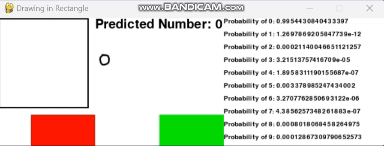

# MNIST Neural Network Project

This project involves training neural networks from scratch (without libraries like TensorFlow or PyTorch) on the MNIST dataset, which consists of handwritten digits. The neural networks are designed using Python and utilize basic building blocks such as forward propagation and loss functions. In this repository i have trained two neural networks with different architecture, and have written a program which demonstrates the second network in action.

## Network Implementations

### Network 1
- **Structure**: 
  - Input Layer: 784 neurons (28x28 image)
  - Hidden Layer: 128 neurons
  - Output Layer: 10 neurons (one for each digit 0-9)
- **Training Rate**: 0.1
- **Epochs**: 2000
- **Accuracy**: 90.74%

### Network 2
- **Structure**:
  - Input Layer: 784 neurons
  - Hidden Layers: 128 neurons (first layer), 64 neurons (second layer)
  - Output Layer: 10 neurons
- **Training Rate**: 0.1
- **Epochs**: 2000
- **Accuracy**: 94.09%

## Files Included

- `network1.py`: Contains the code for Network 1 (1 hidden layer) and its training.
- `network2.py`: Contains the code for Network 2 (2 hidden layers) and its training.
- `manualTestN1.py`: A slightly messy script I used to see the images given to the network and displays the results the network comes up with in command line.
- `visualExample.py`: A Pygame application where users can draw a number in a box. The drawn image is processed to be the correct format for the network and sent to the neural network to predict the digit. The prediction is then displayed to the user on the GUI along with the probability for each number.
- `learnings.md`: A markdown file elaborating on what I have learnt from this project.

## visualExample.py demo


## How to Run

1. Clone the repository:
 ```bash
    git clone https://github.com/noahdavis05/MNIST-Intro.git
 ```
2. Ensure you have numpy, pygame, scikit-image, matplotlib (only for manualTestN1.py)
3. To train either of the models yourself.
```
python network1.py
python network2.py
```
4. To use the visual drawing example.
```
python visualExample.py
```
   
